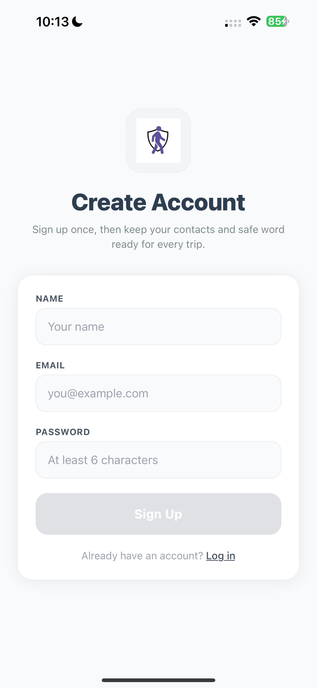
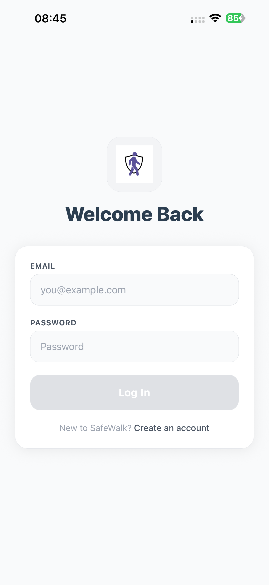
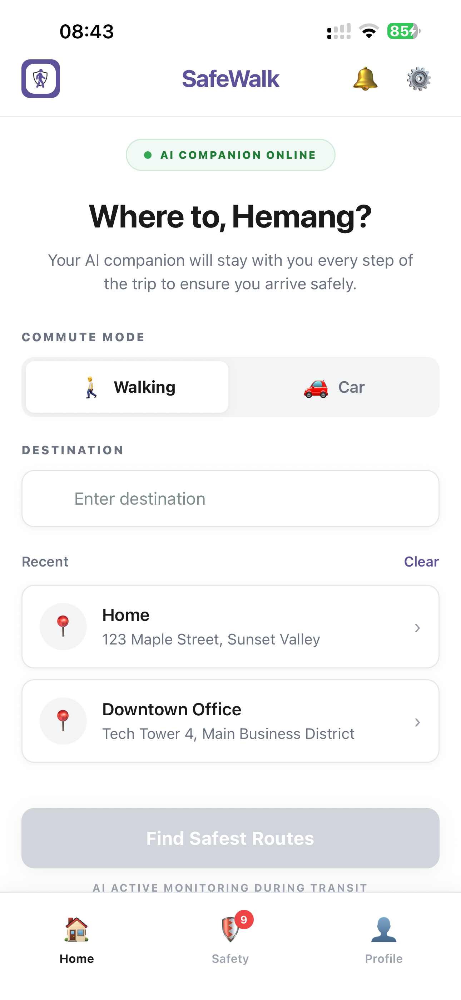
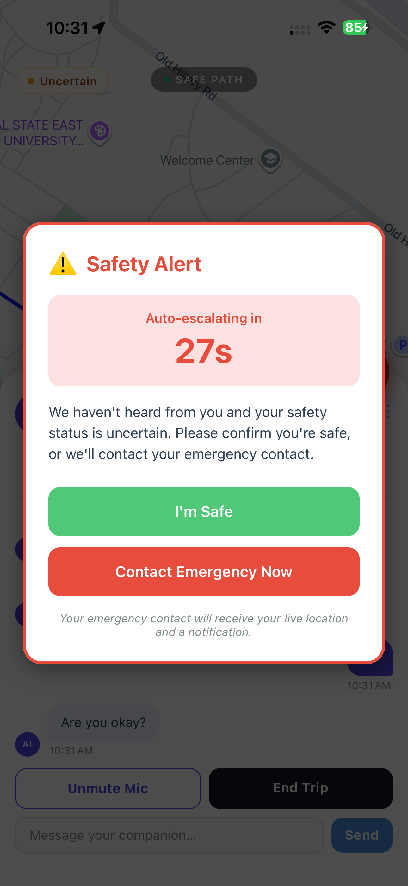
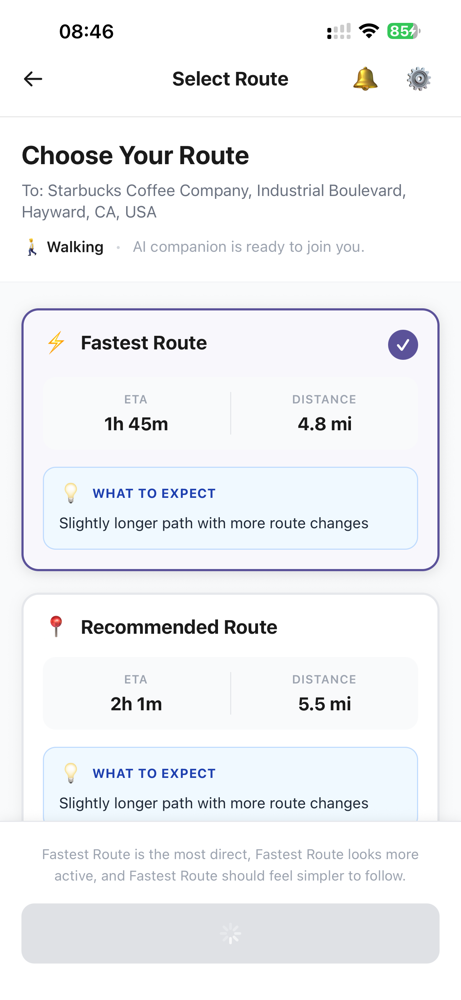
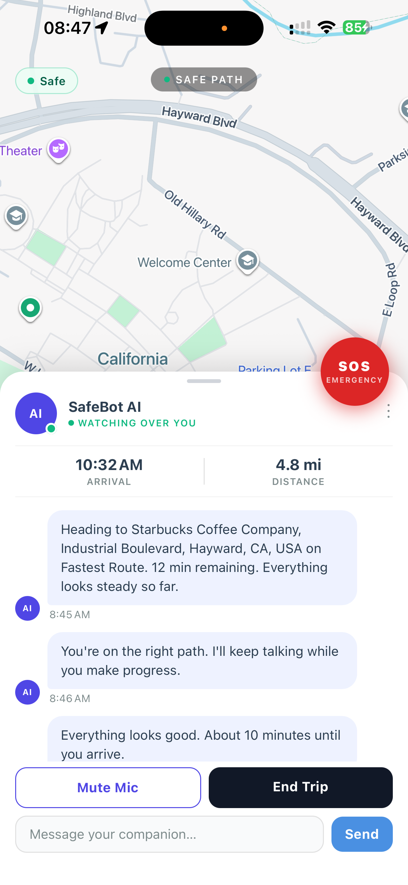
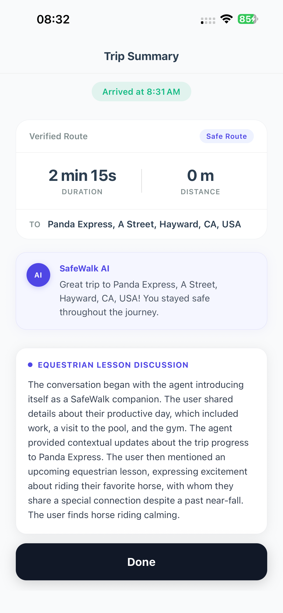
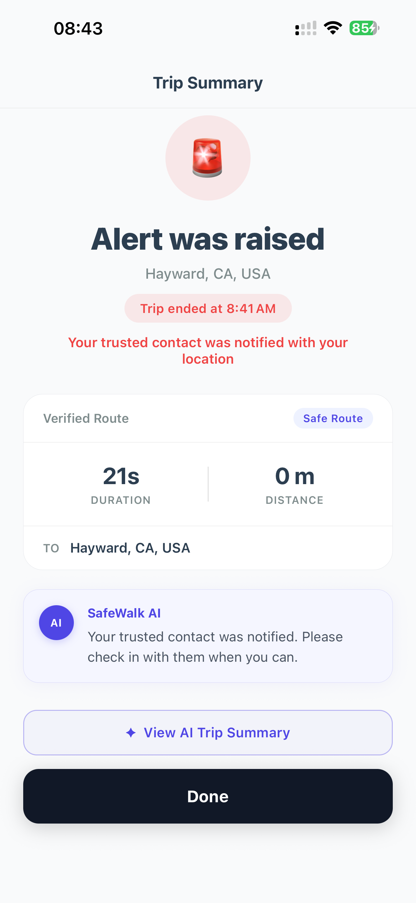

# SafeWalk

SafeWalk is an AI-powered walking companion that stays with a user throughout their trip, keeps a live voice conversation going, monitors the journey in real time, and escalates to a trusted contact when something goes wrong.

The product is built around one idea: safety should not begin only after the user realizes they are in danger. SafeWalk combines companionship, route awareness, live trip monitoring, safe-word detection, SOS, and trusted-contact escalation into a single mobile experience.

## Screenshots

<table>
  <tr>
    <td align="center">
      
      <br />
      <strong>Sign Up</strong>
    </td>
    <td align="center">
      
      <br />
      <strong>Login</strong>
    </td>
    <td align="center">
      
      <br />
      <strong>Home</strong>
    </td>
    <td align="center">
      
      <br />
      <strong>Safety Setup</strong>
    </td>
  </tr>
  <tr>
    <td align="center">
      
      <br />
      <strong>Choose Route</strong>
    </td>
    <td align="center">
      
      <br />
      <strong>Active Trip</strong>
    </td>
    <td align="center">
      
      <br />
      <strong>Trip Summary</strong>
    </td>
    <td align="center">
      
      <br />
      <strong>Trip Summary</strong>
    </td>
  </tr>
</table>

## What SafeWalk Does

- Starts with destination input and route planning
- Fetches route options from Google Maps
- Generates deterministic route observations from real route metrics
- Runs a live AI companion conversation for the duration of the trip
- Shows visible trip safety state: `Safe`, `Uncertain`, `Risk detected`
- Supports a safe word, manual SOS, and inactivity-based escalation
- Sends emergency alerts to a trusted contact with trip context and location
- Saves user profile, safe word, and emergency contacts with Firebase

## Core User Flow

1. User signs up or logs in
2. User enters destination and trip mode
3. User chooses a saved safe word or creates a new one
4. User confirms emergency contacts and current location
5. App fetches route options from Google Maps
6. User selects a route and starts the trip
7. SafeWalk begins a live AI conversation and monitors the trip
8. If a safe word, late response, or SOS is triggered, SafeWalk escalates
9. Trip ends with a summary screen and optional conversation feedback

## Project Description

SafeWalk is designed as an active safety companion rather than a passive emergency tool.

Instead of only offering a panic button or background location sharing, the app stays engaged with the user throughout the journey. It combines:

- conversational AI companionship
- route awareness using Google Maps data
- live trip monitoring
- safe-word detection
- SOS and escalation flows
- trusted-contact alerting

The goal is to create a product that feels emotionally supportive in normal use, while still becoming decisive when the situation turns critical.

## Tech Stack

### Mobile App
- React Native
- Expo
- Expo Router
- TypeScript

### Maps and Routing
- Google Maps Platform
- `react-native-maps`
- Google Directions and Places Autocomplete via backend

### AI and Voice
- ElevenLabs conversational agent
- LiveKit / WebRTC native integration

### Backend
- Node.js
- Express
- TypeScript

### Data and Auth
- Firebase Authentication
- Cloud Firestore

### Alerts
- Nodemailer
- SMTP email delivery for trusted-contact alerts

## Project Structure

```text
safe-walk/
├── app/                     # Expo Router screens
├── assets/                  # App branding/assets
├── backend/                 # Express backend
│   ├── src/config/          # Backend env/config
│   ├── src/routes/          # API routes
│   ├── src/services/        # Maps, email, trip logic
│   └── src/types/           # Backend domain types
├── components/              # Shared React Native components
├── constants/               # Shared constants and theme
├── context/                 # Auth and trip state
├── data/                    # Mock/demo UI data
├── hooks/                   # Platform hooks and conversation hooks
├── services/                # Frontend API + P3 logic
└── types/                   # Shared frontend types
```

## Main Features

### 1. Account and Safety Setup
- Email/password sign up and login
- Firebase-backed user profile
- Saved safe word
- Saved emergency contacts

### 2. Route Awareness
- Route options from Google Maps
- ETA and distance
- Rule-based route observations from route metrics
- Comparison text without fake safety scoring

### 3. Live Trip Experience
- Route map and trip status
- AI companion message stream
- Live voice session for the full trip
- Visible safety indicator

### 4. Safety Triggers
- Safe word detection
- Manual SOS
- Late-response countdown escalation

### 5. Escalation
- Alert state modal
- Trusted-contact email alert
- Trip complete screen after escalation

## Route Observation System

SafeWalk does not use LLM-generated route scoring for the route cards.

Instead, route observations are generated from real Google Maps route data and inferred metrics such as:

- ETA
- distance
- step count
- turn count
- intersection-count proxy
- main-road ratio
- nearby-place signal count
- residential/commercial area proxy

This keeps the route summary believable, deterministic, and demo-safe.

## Safety Logic

### Safe
- User is on route
- No issue detected

### Uncertain
- Late response or suspicious inactivity
- Countdown alert shown with vibration

### Risk Detected
- Safe word used
- SOS pressed
- Countdown expires
- Backend escalates trip status

## Screens

- Login
- Sign Up
- Home / Start
- Safety Setup
- Route Selection
- Active Trip
- Emergency Escalation Modal
- Trip Complete / Feedback

## Setup

### 1. Install app dependencies

```bash
npm install
```

### 2. Install backend dependencies

```bash
cd backend
npm install
cd ..
```

### 3. Create the frontend environment file

Use `.env.example` as a starting point:

```bash
cp .env.example .env
```

Frontend env values:

```env
EXPO_PUBLIC_API_URL=http://YOUR_LOCAL_IP:3000
EXPO_PUBLIC_ELEVENLABS_AGENT_ID=
EXPO_PUBLIC_ELEVENLABS_USE_SERVER_TOKEN=false
ELEVENLABS_API_KEY=
GOOGLE_MAPS_API_KEY=

EXPO_PUBLIC_FIREBASE_API_KEY=
EXPO_PUBLIC_FIREBASE_AUTH_DOMAIN=
EXPO_PUBLIC_FIREBASE_PROJECT_ID=
EXPO_PUBLIC_FIREBASE_STORAGE_BUCKET=
EXPO_PUBLIC_FIREBASE_MESSAGING_SENDER_ID=
EXPO_PUBLIC_FIREBASE_APP_ID=
```

Notes:
- `EXPO_PUBLIC_API_URL` must use your Mac/PC LAN IP for physical device testing
- `GOOGLE_MAPS_API_KEY` is injected into native config through `app.config.js`
- `ELEVENLABS_API_KEY` is only required when using a private ElevenLabs agent token flow

### 4. Create backend env values

In `backend/.env` add:

```env
PORT=3000
GOOGLE_MAPS_API_KEY=
SMTP_HOST=
SMTP_PORT=587
SMTP_USER=
SMTP_PASS=
SMTP_FROM=
```

For Gmail SMTP, use an app password rather than your account password.

### 5. Configure Firebase

Enable:
- Email/Password authentication
- Firestore Database

Recommended Firestore rules:

```txt
rules_version = '2';
service cloud.firestore {
  match /databases/{database}/documents {
    match /users/{userId} {
      allow read, write: if request.auth != null && request.auth.uid == userId;

      match /emergencyContacts/{contactId} {
        allow read, write: if request.auth != null && request.auth.uid == userId;
      }
    }
  }
}
```

### 6. Start the backend

```bash
cd backend
npm run dev
```

Backend runs by default at:

```text
http://localhost:3000
```

### 7. Start the Expo app

```bash
npx expo start --dev-client --clear
```

### 8. Run on a platform

#### Web

```bash
npm run web
```

#### iOS / Android dev build

```bash
npm run ios
npm run android
```

For the live ElevenLabs conversation flow, use a native dev build rather than Expo Go.

## Native Notes

### Google Maps
- `GOOGLE_MAPS_API_KEY` is read from environment and injected through `app.config.js`
- A native rebuild is required after changing native map config

### ElevenLabs / Voice
- Requires native modules
- Works in dev builds, not Expo Go
- Uses a continuous conversation session for the trip duration

## Email Alerts

SafeWalk currently uses email alerts for escalation.

Alert emails include:
- user name
- trip ID
- origin and destination
- alert reason
- latest known location
- Google Maps link
- trip mode
- timestamp

## Development Commands

### Frontend

```bash
npm install
npx expo start --dev-client --clear
npm run web
npm run ios
npm run android
```

### Backend

```bash
cd backend
npm install
npm run dev
npm run build
npm run start
```

### Typecheck

```bash
npx tsc --noEmit
cd backend && npx tsc --noEmit
```

## Why This Project Matters

Most safety tools are reactive. They help only after the user decides something is wrong.

SafeWalk is different because it is proactive:
- it stays with the user during the trip
- it keeps conversation going
- it monitors the trip state
- it escalates when the user needs help

That combination of companionship and protection is the core product.
